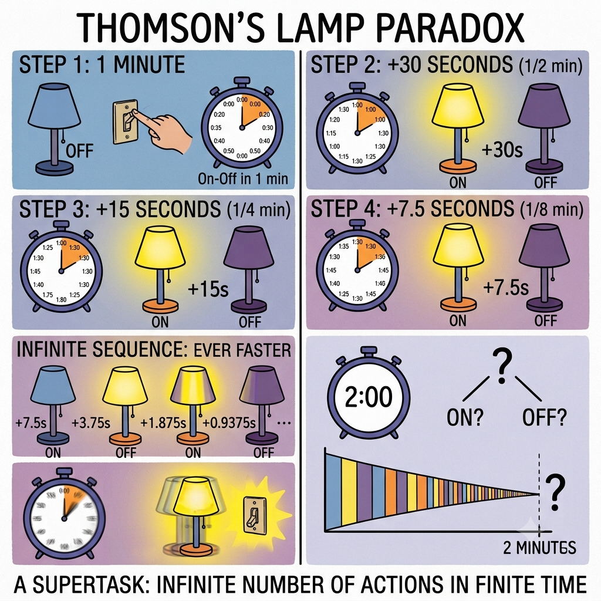
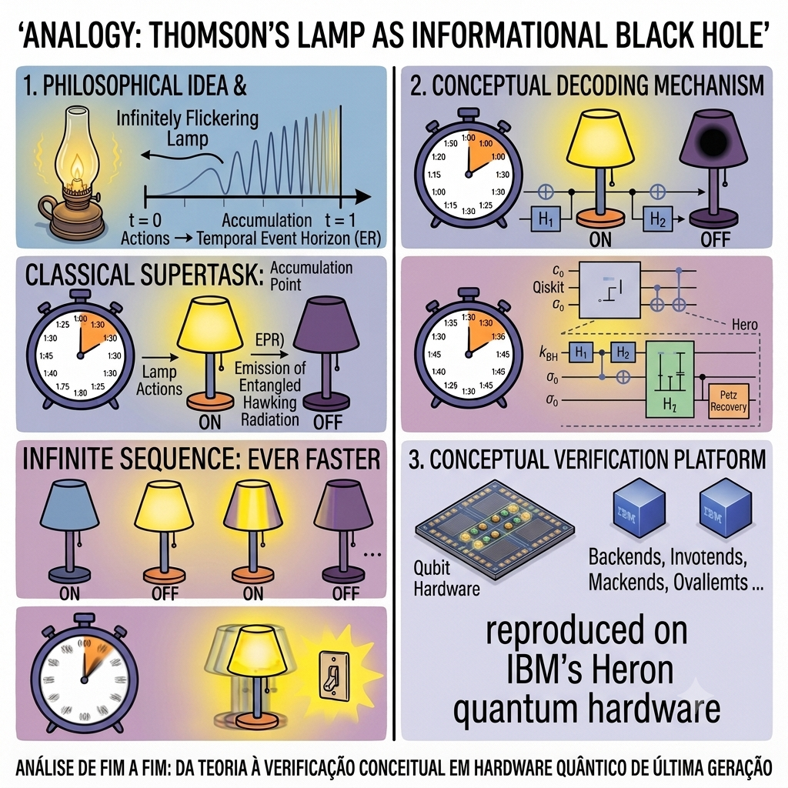
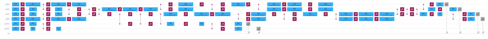

# Thomson's Lamp as an Informational Black Hole [](https://doi.org/10.5281/zenodo.21711629)

**A conceptual physics project.** This repository takes a philosophical analogy — between the Thomson's Lamp supertask and the Hayden-Preskill black hole information recovery problem — turns it into concrete quantum circuits, and checks the resulting claims numerically, against a calibrated noise model, and on real IBM quantum hardware.






**A conceptual physics project.** This repository takes a philosophical analogy — between the Thomson's Lamp supertask and the Hayden-Preskill black hole information recovery problem — turns it into concrete quantum circuits, and checks the resulting claims numerically, against a calibrated noise model, and on real IBM quantum hardware.


> **Status:** protocol derived, verified mathematically, validated on an exact simulator, calibrated against a realistic noise model, and **reproduced in two real runs on IBM Heron r2** (`ibm_marrakesh`, 2026-07-27). Read [Scope](#scope-what-this-is-and-isnt) before drawing conclusions from the hardware numbers.

## Scope: what this is, and isn't

**This is:**
- A worked example of turning a loose philosophical analogy into a falsifiable numerical claim — and then falsifying half of it.
- A from-scratch derivation and verification of the Yoshida–Kitaev decoding protocol for Hayden–Preskill recovery (arXiv:1710.03363), with an honest trail of bugs found and fixed along the way.
- A small hardware run confirming the derivation holds up on a real noisy device, within the limits of a single-basis post-selected measurement.

**This is not:**
- A new physics result. The Page curve, Hayden–Preskill decoding, and the Yoshida–Kitaev protocol are established results (1993–2019) that have already been run on real quantum hardware several times over — see [Related Work](#related-work). Nothing here changes that literature.
- A rigorous hardware benchmark. The fidelity number below comes from a single Bell-basis measurement, not multi-basis tomography — the caveats are spelled out in [`REPORT.md`](REPORT.md).

If you're looking for a thorough hardware-benchmarking study of this protocol, the closest and more complete prior work is Shapoval et al. (2023), who ran essentially the same wormhole-inspired teleportation protocol across five IBM superconducting processors and a Quantinuum trapped-ion system. This repository doesn't try to compete with that — it documents a self-contained derivation-to-hardware exercise instead, and the value is mostly in the process, not the headline number.

## Key results

| | Predicted | Measured (real hardware) |
|---|---|---|
| Herald success probability | 0.238 ± 0.008 | 0.2362 and 0.2385 (two runs) |
| Fidelity conditioned on success | 0.94–0.96 | 0.9130 |

For context: a June 2026 paper running the same circuit topology on trapped-ion cloud hardware reports 0.906 (IonQ Aria 1) and 0.742 (IonQ Harmony) under a comparable single-basis metric. 0.9130 sits within the range current-generation hardware achieves in general — it isn't a standout result tied to this particular device.

## Repository structure

```
.
├── README.md                          — you are here
├── REPORT.md                          — full write-up: analogy, critique, H1-vs-H2 test,
│                                         three decoding attempts, Yoshida-Kitaev derivation,
│                                         noise-calibrated prediction, hardware run
├── scripts/
│   └── submit_to_heron_final_v2.py    — self-contained submission script (IBM Quantum Runtime)
├── requirements.txt
└── LICENSE
```

Other files mentioned in `REPORT.md` (the full analysis notebook, `thomson_hp.py`, `petz_test.py`, `yoshida_kitaev.py`, `yk_qiskit_circuit.py`) are not yet included in this repository. What's here is the finished write-up and the exact script used for the hardware runs.

## Reproducing the hardware run

```bash
pip install -r requirements.txt
```

Set `IBM_QUANTUM_TOKEN` and `IBM_INSTANCE_CRN` as environment variables (or as Colab secrets), then:

```bash
python scripts/submit_to_heron_final_v2.py
```

**Never commit a notebook or script with the token filled in. If a token is ever exposed, revoke it immediately.**

## Related work

The Thomson's-Lamp framing is new; the underlying physics is not. Closest prior work, roughly in order of relevance to this repository:

| Work | Year | Hardware | What it did |
|---|---|---|---|
| Landsman et al., *Nature* 567, 61 | 2019 | trapped ions (7 qubits) | First hardware verification of Hayden–Preskill scrambling and decoding, via partial tomography; ~80% fidelity |
| Czelusta & Mielczarek, arXiv:2103.14996 | 2021 | IBM Santiago (5-qubit superconducting) | Deterministic "recycled" ER=EPR teleportation protocol (related but not identical to Yoshida–Kitaev); fidelities above the classical 2/3 bound |
| Blok et al., *PRX* 11, 021010 | 2021 | superconducting qutrit processor | Scrambling signatures on superconducting hardware, without a full decoding protocol |
| Schuster, Kobrin, Gao et al., *PRX* 12, 031013 | 2022 | trapped ions | Deterministic, more scalable Clifford-based successor to the Yoshida–Kitaev protocol, from the original authors' group |
| Jafferis et al., *Nature* 612, 51 | 2022 | Google Sycamore | The widely publicized "wormhole" experiment; publicly disputed by a comment from Kobrin, Schuster & Yao (arXiv:2302.07897) |
| **Shapoval, Su, de Jong, Urbanek, Swingle, *Quantum* 7, 1138** | 2022/23 | **five IBM superconducting QPUs + Quantinuum H1-1** | Closest prior art to this repository: essentially the same protocol, run as a dedicated multi-device benchmarking study; best signal at 80% of theoretical predictions |
| arXiv:2601.15536 | 2026 | theory | A more practical/efficient successor protocol, explicitly linked to the Yoshida–Kitaev decoder |
| arXiv:2606.16451 | 2026 | trapped ions (IonQ) | The same circuit topology used here (Haar-scrambling unitary + conjugate + Bell measurement + post-selection), used as a hardware-error diagnostic tool rather than a headline result |

## License

Code: MIT (see `LICENSE`). Feel free to treat the write-up in `REPORT.md` as CC-BY-4.0 if you reuse it.
